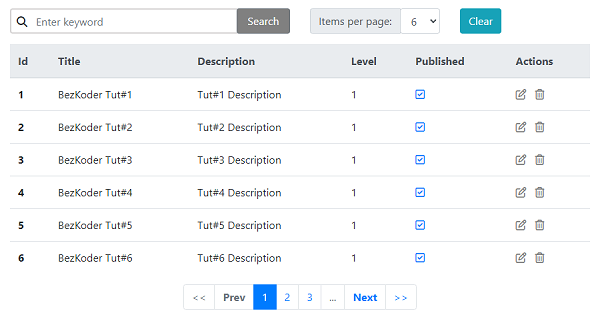

# Spring Boot Thymeleaf Pagination example

Build Thymeleaf Pagination in Spring Boot example with Bootstrap. Using Spring Data JPA to interact with H2/MySQL/PostgreSQL database.



For more detail, please visit:
> [Thymeleaf Pagination example](https://www.bezkoder.com/thymeleaf-pagination/)

More Practice:
> [Spring Boot Thymeleaf CRUD example](https://www.bezkoder.com/spring-boot-thymeleaf-example/)

> [Spring Boot File upload example with Multipart File](https://www.bezkoder.com/spring-boot-file-upload/)

> [Spring Boot Pagination & Filter example | Spring JPA, Pageable](https://www.bezkoder.com/spring-boot-pagination-filter-jpa-pageable/)

> [Spring Data JPA Sort/Order by multiple Columns | Spring Boot](https://www.bezkoder.com/spring-data-sort-multiple-columns/)

> [Spring Boot Repository Unit Test with @DataJpaTest](https://www.bezkoder.com/spring-boot-unit-test-jpa-repo-datajpatest/)

> [Deploy Spring Boot App on AWS – Elastic Beanstalk](https://www.bezkoder.com/deploy-spring-boot-aws-eb/)

Exception Handling:
> [Spring Boot @ControllerAdvice & @ExceptionHandler example](https://www.bezkoder.com/spring-boot-controlleradvice-exceptionhandler/)

> [@RestControllerAdvice example in Spring Boot](https://www.bezkoder.com/spring-boot-restcontrolleradvice/)

Rest API:
> [Spring Boot + MySQL: CRUD Rest API example](https://www.bezkoder.com/spring-boot-jpa-crud-rest-api/)

> [Spring Boot + PostgreSQL: CRUD Rest API example](https://www.bezkoder.com/spring-boot-postgresql-example/)

> [Spring Boot + SQL Server: CRUD Rest API example](https://www.bezkoder.com/spring-boot-sql-server/)

> [Spring Boot + H2: CRUD Rest API example](https://www.bezkoder.com/spring-boot-jpa-h2-example/)

> [Spring Boot + MongoDB: CRUD Rest API example](https://www.bezkoder.com/spring-boot-mongodb-crud/)

> [Spring Boot + Oracle: CRUD Rest API example](https://www.bezkoder.com/spring-boot-hibernate-oracle/)

> [Spring Boot + Cassandra: CRUD Rest API example](https://www.bezkoder.com/spring-boot-cassandra-crud/)

Security:
> [Spring Boot + Spring Security JWT Authentication & Authorization](https://www.bezkoder.com/spring-boot-jwt-authentication/)

Fullstack:
> [Vue + Spring Boot example](https://www.bezkoder.com/spring-boot-vue-js-crud-example/)

> [Angular 8 + Spring Boot example](https://www.bezkoder.com/angular-spring-boot-crud/)

> [Angular 10 + Spring Boot example](https://www.bezkoder.com/angular-10-spring-boot-crud/)

> [Angular 11 + Spring Boot example](https://www.bezkoder.com/angular-11-spring-boot-crud/)

> [Angular 12 + Spring Boot example](https://www.bezkoder.com/angular-12-spring-boot-crud/)

> [Angular 13 + Spring Boot example](https://www.bezkoder.com/spring-boot-angular-13-crud/)

> [Angular 14 + Spring Boot example](https://www.bezkoder.com/spring-boot-angular-14-crud/)

> [React + Spring Boot + MySQL example](https://www.bezkoder.com/react-spring-boot-crud/)

> [React + Spring Boot + PostgreSQL example](https://www.bezkoder.com/spring-boot-react-postgresql/)

Run both Back-end & Front-end in one place:
> [Integrate Angular with Spring Boot Rest API](https://www.bezkoder.com/integrate-angular-spring-boot/)

> [Integrate React.js with Spring Boot Rest API](https://www.bezkoder.com/integrate-reactjs-spring-boot/)

> [Integrate Vue.js with Spring Boot Rest API](https://www.bezkoder.com/integrate-vue-spring-boot/)

## Run Spring Boot application
```
mvn spring-boot:run
```

